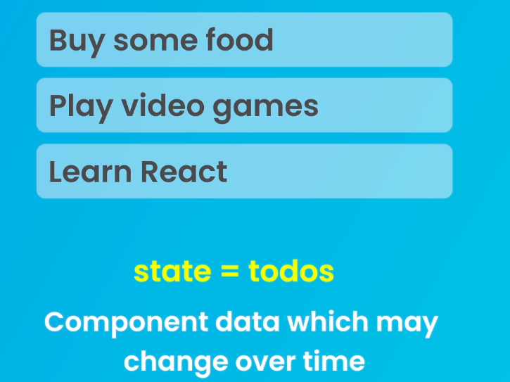
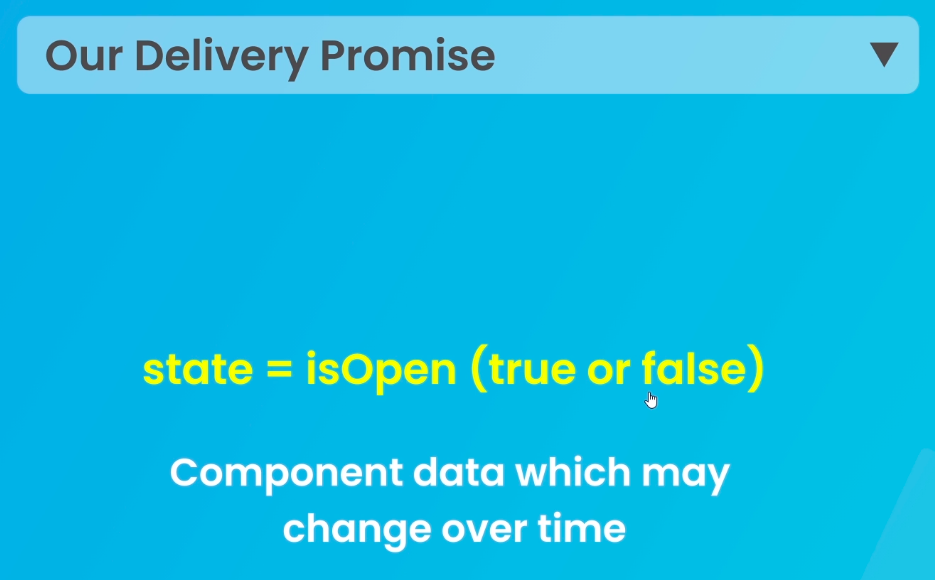
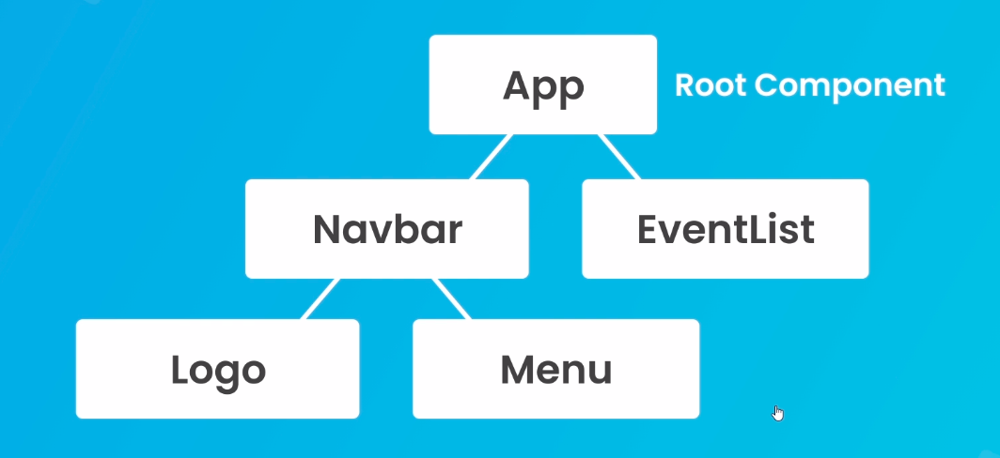
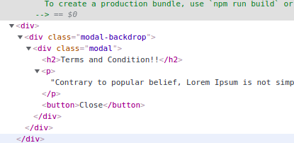
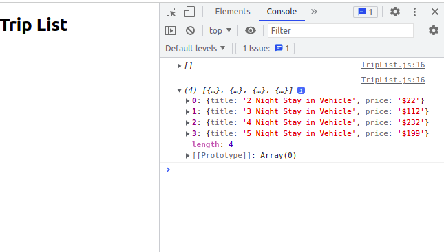
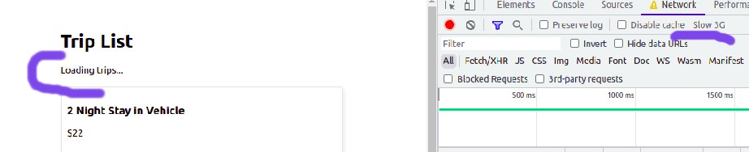
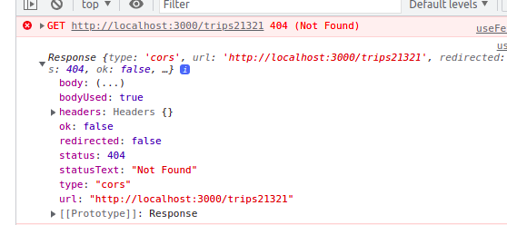

# React Js Notes

[Using react with cdn](#Using-react-with-cdn) 

[Making React Component](#Making-React-Component)

[JSX and Templates](#JSX-and-Templates)

[Dynamic Values in Templates](#Dynamic-Values-in-Templates)

[Click Events & Event Handlers](#Click-Event-&-Event-Handlers)

[Using inline functions](#Using-inline-functions)

[Create a React Application](#Create-a-React-Application)

[Making React Site](#Making-React-Site)

[Intro to State & useState](#Intro-to-State-&-useState)

[State Implementation usig useState Hook](#State-Implementation-usig-useState-Hook)

[Outputting List](#Outputting-List)

[Using the Previous State](#using-the-previous-state)

[Conditional Templates](#Conditional-Templates)

[Using Multiple Components](#Using-Multiple-Components)

[Creating a Title Component](#Creating-a-Title-Component)

[Props](#Props)

[Using React Fragments](#Using-React-Fragments)

[Creating React Fragment using React.Fragment keyword](#creating-react-fragment-using-reactfragment-keyword)

[Children Prop (Making a Modal Component)](#Children-Prop-(Making-a-Modal-Component))

[Reusing Modal Component](#Reusing-Modal-Component)

[Function as Props](#Function-as-Props)

[Challenge - Showing the Modal](#challenge---showing-the-modal)

[Portals](#Portals)

[Challenge - Reusable Event List Component](#challenge---reusable-event-list-component)

[Using Global Stylesheets](#Using-Global-Stylesheets)

[Components Stylesheets](#Components-Stylesheets)

[Inline Stylesheet](#Inline-Stylesheet)

[Dynamic Inline Styles](#Dynamic-Inline-Styles)

[Conditional CSS Class](#Conditional-CSS-Class)

[CSS Modules](#CSS-Modules)

[Forms and Labels in React](#Forms-and-Labels-in-React)


# Using react with cdn

[React CDN Links](https://reactjs.org/docs/cdn-links.html)

Copy paste the links to our html page.


Add Babel cdn link to our html page.

Babel is used to compiile our react application at runtime.

[Babel CDN](https://babeljs.io/setup#installation)


```html
<!DOCTYPE html>
<html lang="en">
<head>
    <meta charset="UTF-8">
    <meta http-equiv="X-UA-Compatible" content="IE=edge">
    <meta name="viewport" content="width=device-width, initial-scale=1.0">
    <script crossorigin src="https://unpkg.com/react@17/umd/react.development.js"></script>
    <script crossorigin src="https://unpkg.com/react-dom@17/umd/react-dom.development.js"></script>
    <script src="https://unpkg.com/@babel/standalone/babel.min.js"></script>
    <title>Document</title>
</head>
<body>
    <h1>Website</h1>


    <script type="text/babel">
        Ban
    </script>
</body>
</html>
```

# Making React Component

React component is a javascript function.

```html
<script type="text/babel">
    const Banner = () => {
        return (
            <div>
                <p>Banner</p>
            </div>
        )
    }
</script>
```

- function Banner is a react component.
- template is created inside return function.
- Here code inside the return() is JSX template. and not HTML template.

- 

- In JSX v use className in pJSX allows to create html style templates, and in background Babel transpiles this jsx templates to html. and renders that html template to DOM.lace of class. while transpiling to html, it got converted to class.

- Next, we have to inject this template to html page by rendering it to DOM.

```html
    <script type="text/babel">
        const Banner = () => {
            return (
                <div>
                    <p>Banner</p>
                </div>
            )
        }
    //  RENDER component to DOM 
    ReactDOM.render(<Banner />, document.getElementById('banner'));
    </script>
```

ReactDOM - call render method - pass component and location we want to render the component.

```js
ReactDOM.render(<Component name />, location_in_html_template);
```

# JSX and Templates

JSX allows to create html style templates, and in background Babel transpiles this jsx templates to html. and renders that html template to DOM.

### Classes in JSX template

- classes are declared using className attribute.

```jsx

    return (
        <div className="banner">
            <p>Banner</p>
        </div>
    )
```

After template is transpiled to html, it got converted to class.

### Only one root element is allowed in JSX template.

```jsx
return (
    <div className="banner">
        <p>Banner</p>
    </div>
    <div>
        
    </div>
)
```

Here, we have two root divs which is not allowed
New element is nested under root div.


# Dynamic Values in Template

Using curly braces to add dynamic values to the template.,

```js
const Banner = () => {
    const title="my new website"
    const subtitle = "hey look this is my website"
    return (
        <div className="banner">
            <h2>{title.toUpperCase()}</h2>
            <p>{subtitle}</p>
            <p>Today's date is: {new Date().toDateString()} </p>
            <p>Random Number: {Math.random()*100}</p>
        </div>
    )
}
```

- using curly braces we can use variables inside template expression.
- we can also inject variables to html attributes using curly braces.


# Click Events & Event Handlers

```js
const Banner = () => {
    const title = "welcome to my website"
    const buttonClick = (e) => {
        console.log('button click)
        console.log(title);
        console.log(e)
    }
    return (
        <div className="banner">
            <button onClick={buttonClick}>Click Me</button>
        </div>
    )
}
```
- onClick event is a event handler.
- Pass reference to function as an argument to onClick event.
- When button is clicked function outside the template is called.
- can get event object e.


# Using inline functions

```jsx
return (
    <div className="banner">
        <button onClick={(e) => {
            console.log(e)
        }}>Click Me</button>
    </div>
)
```

- We defined a function inside the template.

# Create a React Application

- Install Nodejs
- Go thru below link

  [Creating an App](https://github.com/facebook/create-react-app)

or run below command

```terminal
npx create-react-app my-app
cd my-app
npm run start
```

Check React Version

```terminal
npm view react version
```

# Making React Site

**Note:**
All codes are compiled to Jaascript for the browser to understand


## Images in react

1. we can store images in public folder

    IF we we use this method, no need to dynamically load images.
    Instead provide the path to the image.

2. Also we can store images in src folder by creating a folder named assets.

# Intro to State & useState

### State and Why we need it.

- A state is a component data that change over time.
- for example, consider a todolist application, where todo is a state.
- todo changes overtime.
- todo can be added, deleted, updated, etc.



### Example - 2

Consider a dropdown button, on click of the button, dropdown menu will appear.
here we dont need a state to store the dropdown menu and its content.

State can be a toggle that sets to True or False on clicking the dropdown button.




# State Implementation usig useState Hook

```js
const Home = () => {
  let name = 'jissmon';
  const handleClick = () => {
    name = 'thala ajith';
    console.log(name);
  };
  return (
    <div className='home'>
      <h2>HomePage</h2>
      <p>{name}</p>
      <button onClick={handleClick}>Click Me</button>
    </div>
  );
};
```

- Here, the value of name in p tag wont change even we click the button.
- So we use a hook called useState to change the value of name on button click.

```js
import { useState } from 'react';

const Home = () => {
  const [state, setstate] = useState('data science');
  const handleClick = () => {
    setstate('machine learning');
    console.log(state);
  };
  return (
    <div className='home'>
      <h2>HomePage</h2>
      <p>{state}</p>
      <button onClick={handleClick}>Click Me</button>
    </div>
  );
};
```

- First import **useState** hook from react.
- Here we have used **useState** hook to change the value of state.
- **useState** hook returns an array of two values.
- We can capture those values using **array destructuring**.
- First value is the current state.
- Second value is a function that we can use to change the state.

    ```js
    const [state, setstate] = useState('data science');
    ```

- Define a function called **handleClick**.
- Invoke **setstate** function and pass new value as an argument.
- Initially value is set to 'data science'.
- When we click the button, the value of state changes to 'machine learning'.

### UseState React Hook - Another Example

- Not neccessary to provide state and usestate, we can give any value to assign **useState** hook.  

```js
const [country, setcountry] = useState("ukraine");
const handleCountry = () => {
    setcountry("russia");
    console.log(country);
}
return (
    <div className="App">
        <h1>{state}</h1>
        <button onClick={handleClick}>Click me</button>
        <h2>{country}</h2>
        <button onClick={handleCountry}>Click Me</button>
    </div>
);
```

# Outputting List

1. First create a state to store the list of items.

```js
const [events , setEvents] = useState([
    {title: "React", date: "01.01.2020", id: 1},
    {title: "Angular", date: "01.01.2020", id: 2},
    {title: "Vue", date: "01.01.2020", id: 3},
]);
```

2. We have to render this list in html template, for that purpose we use jaavscript
map function to loop through each items in the list.


3. **map** method called on events where we get access to each values in the list.
Then using JSX template to display each one in the list. when we o/p a list in jsx template, root template must have a **key** property to keep track of each item when DOM outputs it. So if data changes at any point of time, react will keep track of it. **keys** are unique for each item.


```js
return (
    <div className="App">
      {events.map((event) => (
          <div className='event-preview' key={event.id}>
            <h2>{event.title}</h2>
            <p>{event.date}</p>
          </div>
      ))}
    </div>
  );
```

- `event.id` refers to **key** property here. which is unique for each item. it can be any unique property not just **id**.

- While applying **map** function on state, we also get an index of each item.

```jsx
{events.map((event, index) => (
    <div className='event-preview' key={event.id}>
        <h2>{index} - {event.title}</h2>
        <p>{index} - {event.date}</p>
    </div>
))}
```

# Using the Previous State

If we want to delete an event from the list, here is how we do it.

```js
{events.map((event, index) => (
    <div className='event-preview' key={event.id}>
        <h2>{index} - {event.title}</h2>
        <p>{index} - {event.date}</p>
        <button onClick={() => handleClick(event.id)}>Delete Event</button> 
    </div>
))}
```

- We pass the reference to **handleClick** function in **onClick** event of the button.
- We have to pass the id of the event to be deleted as an argument to **handleClick** function.
- We put **handleClick** function as a callback since we are passing id argument to the same. If not, handleClick executes all time we load the page.
- We capture the id of each event we want to delete.


### Delete the event from the list.

```js
  const handleClick = (id) => {
    // filter method returns a new array with the items that match the condition
    setEvents((prevEvents) => {
        return prevEvents.filter((event) => event.id !== id);
    }))
    // when ids are same that id is filtered out.
  }
```

# Conditional Templates

- **Conditional templates** are used to render a template based on the condition.
- For example, if there is a boolean state, we can render a template based on the True or False value.


## Implementation

- Define a state to store the boolean value.

```js
const [showEvents, setShowEvents] = useState(true);
```

- Invoke setShoeEvents function to change the value of showEvents on button click.

```jsx
<button onClick={() => setShowEvents(false)}>Hide Events</button>
<button onClick={() => setShowEvents(true)}>Show Events</button>
```

## Conditionally ouput events from the list.

```jsx
{showEvents && events.map((event, index) => (
    <div className='event-preview' key={event.id}>
        <h2>{index} - {event.title}</h2>
        <p>{index} - {event.date}</p>
        <button onClick={() => handleClick(event.id)}>Delete Event</button> 
    </div>
))}
```

- Here we pass showEvents state to jsx template as a javascript expresion.
- If only both the values are true, then we can render the events.
- If not we can hide the events.


## Conditionally ouput the button to show and hide the events.

```jsx
{
    showEvents && (
        <div>
        <button onClick={() => setShowEvents(false)}>Hide Events</button>
        </div>
    )
}

{
    !showEvents && (
        <div>
        <button onClick={() => setShowEvents(true)}>Show Events</button>
        </div>
    )
}
```

## useState hook limitations

1. useState hook can only be called from top level of a function. We should not call it from inside of a function.

2. Need to be used inside of a React component.


# Using Multiple Components



# Creating a Title Component

- Create a Title component in components folder.

**components/Title.js**

```js
export default function Title() {
    return (
        <div>
            <h1>Mario Kingdom Events</h1>
            <h2>All the latest events in mario kingdom</h2>
        </div>
    )
}
```

- Inject **Title** component into the App component.

**App.js**

```js
<div className="App">
    <Title />
```

- Once Title component is injected, all the contents of the Title component will be rendered in the App component.

- Add some styling to the Title component.

**index.css**

```css
.title {
  display: inline-block;
  padding: 30px 60px;
  background: #f4f4f4;
  border-radius: 8px;
  font-weight: normal;
  margin-bottom: 10px;
}

.subtitle {
  display: inline-block;
  color: #555;
  font-weight: normal;
  padding-bottom: 20px;
  border-bottom: 1px solid f4f4f4;
  margin-top: 10px;
  margin-bottom: 60px;
}
```

# Props

Props are properties that are passed from parent component to child component.

**App.js**

- We can pass props to child component.
- We pass **title** and **subtitle** props to the child component.
- We can pass multiple props to the child component.

```js
<Title title="Mario Kingdom Events" subtitle="All the latest events in mario kingdom"/>
```

**Title.js**

- We pass props paramter to Title function.
- Access the **title** and **subtitle** props in jsx template.

```js
export default function Title(props) {
    return (
        <div>
            <h1 className="title">{props.title}</h1>
            <h2 className="subtitle">{props.subtitle}</h2>
        </div>
    )
}
```

### Destructuring props in jsx template.

```js
export default function Title({title, subtitle}) {
    return (
        <div>
            <h1 className="title">{title}</h1>
            <h2 className="subtitle">{subtitle}</h2>
        </div>
    )
}
```

### Reusing Title Component with different props value

```jsx
<Title title="Mario Kingdom Events" subtitle="All the latest events in mario kingdom"/>
<Title title="Jurassic Park" subtitle="All the latest events in jurassic park"/>
```

# Using React Fragments

- React fragments are empty tags.
- React fragments are used to wrap elements in jsx template.

```js
<>
    <h1 className="title">{title}</h1>
    <br>
    <h2 className="subtitle">{subtitle}</h2>
</>
```

- When we ouput this in DOM, it doesnt output elements in place of empty tags.
- But things inside empty tags are rendered.

[](./IMAGES/image_5.png)

- We can see in the image that title component is not wrapped by parent element since
we use react fragments there.

# Creating React Fragment using React.Fragment keyword

- We cant use react fragments with props by using empty tags.
- Instead We use **React.Fragment** to wrap the elements.

```jsx
<key={event.id}>
    <h2>{index} - {event.title}</h2>
    <p>{index} - {event.date}</p>
    <button onClick={() => handleClick(event.id)}>Delete Event</button> 
</>
```

- Here we use key property to identify the event.
- So we cant put empty tag there.
- But We can use React.Fragment to wrap the elements.

```jsx
<React.Fragment key={event.id}>
    <h2>{index} - {event.title}</h2>
    <p>{index} - {event.date}</p>
    <button onClick={() => handleClick(event.id)}>Delete Event</button> 
</React.Fragment>
```

- This is the longer way to create a React Fragment.
- Advantage is we can have props on the fragment.
- When we output this on DOM, there will be just inner contents of the fragment.
- **React Fragments** are used if we dont want to show the parent element aroung the contents.

# Children Prop (Making a Modal Component)

- Another method of passing inforamtions from parent to child component is by using *children prop*.

,
## Creating a Modal Component

- To create a fucntional component, type **rfc** and press enter.
- It will create react fucntional component if react snippets are insatlled.

**components/Modal.js**

```js
export default function Modal() {
  return (
    <div>
      <div className="modal-backdrop">
          <div className="modal">
              <h2>10% Off Coupon Code!!</h2>
              <p>Use the code NINJA10 at the checkout</p>
          </div>
      </div>
    </div>
  )
}
```
- Import the Modal component into the App component.

**components/App.js**

```js
<Modal />
```

- Apply Styling to Modal Component

**components/Modal.css**

```css
.modal-backdrop {
    position: fixed;
    top: 0;
    left: 0;
    width: 0;
    height: 100%;
    width: 100%;
    background: rgba(0, 0, 0, 0.5);
}
.modal {
    padding: 30px;
    max-width: 480px;
    margin: 200px auto;
    background: #fff;
    border-radius: 10px;
}
```

- Import Modal.css into Modal component.

```js
import '../components/Modal.css';
```

# Reusing Modal Component

**Scenario:** 
- We have to show different modal contents each time.

- We do this by using **Children Prop**.

**App.js**

- Pass contents of Modal component to the Modal component in App.js

```jsx
<Modal>
    <h2>10% Off Coupon Code!!</h2>
    <p>Use the code NINJA10 at the checkout</p>
</Modal>
```

- Add **Children Prop** to Modal component as argument.
- Use **Children Prop** to render the contents of Modal component.

```jsx
export default function Modal({children}) {
  return (
    <div>
      <div className="modal-backdrop">
          <div className="modal">
              {children}
          </div>
      </div>
    </div>
  )
}
```

- We can reuse the modal contents. This way we can show different modal 
contents each time.

```jsx
 <Modal>
    <h2>10% Off Coupon Code!!</h2>
    <p>Use the code NINJA10 at the checkout</p>
</Modal>
<Modal>
    <h2>Terms and Condition!!</h2>
    <p>Contrary to popular belief, Lorem Ipsum is not simply random text. It has roots in a piece of classical Latin literature from 45 BC, making it over 2000 years old.</p>
</Modal>
```

# Function as Props

## Task - Hide the modal based on button click.

### Step 1: Create a State 

**App.js**

```jsx
const [showModal, setShowModal] = useState(true);
```

### Step 2: Create a function to hide the modal.

**App.js**

```jsx
  const handleShowModal = () => {
    setShowModal(false);
  }
```

### Step 3: Pass the function as a prop to the Modal Component.

- Prop is **handleShowModal**

**App.js**

```jsx
<Modal handleShowModal={handleShowModal}>
    <h2>Terms and Condition!!</h2>
    <p>Contrary to popular belief, Lorem Ipsum is not simply random text. It has roots in a piece of classical Latin literature from 45 BC, making it over 2000 years old.</p>
</Modal>
```

### Step 4: Accept the Prop by destructuring it in Modal.js.

**Modal.js**

```js
export default function Modal({children, handleShowModal}) {
```

### Step 5: Attach an onClick Event and Set Reference to the Prop we accepeted.

```js
  return (
    <div>
      <div className="modal-backdrop">
          <div className="modal">
              {children}
            <button onClick={handleShowModal}>Close</button>
          </div>
      </div>
    </div>
  )
}
```

When we click the button, it fires the function we passed as a prop, which in turn changes the value of the state *showModal*. I.e. if *showModal* value is true as default, on clicking the button it changes to True.


### Step 6: Hide the modal on button click

- We put the modal in curly braces and set the condition  along with **showModal**.
- If **showModal** is true, we render the modal.
- If **showModal** is false, we dont render the modal.
- On Clicking the button, we change the value of **showModal** to false.

```jsx
{showModal && (<Modal handleShowModal={handleShowModal}>
    <h2>Terms and Condition!!</h2>
    <p>Contrary to popular belief, Lorem Ipsum is not simply random text. It has roots in a piece of classical Latin literature from 45 BC, making it over 2000 years old.</p>
</Modal>)}
```

# Challenge - Showing the Modal

1. Modal should not show on page by default.
2. When we click the button, modal should show.


```jsx
const [showModal, setShowModal] = useState(false);

{!showModal && (
    <div>
        <button onClick={()=>setShowModal(true)}>Show Modal</button>
    </div>
)}
```

- First set showModal state to false.
- Second set the condition to show the modal on button click.

# Portals

- Portals in react means take a component and render it somewhere else in the DOM.
- Ie. We take a component and render it somewhere else in the DOM.

For example: We can pick **Modal** component and dump it sowhere else in the DOM.

- We use **ReactDOM.portal()** to achieve this.
- ReactDOM.portal() takes 2 arguments.
    1. Component Template
    2. Location we wish to render that template.

```jsx
return (ReactDOM.createPortal((
    <div>
      <div className="modal-backdrop">
          <div className="modal">
              {children}
            <button onClick={handleShowModal}>Close</button>
          </div>
      </div>
    </div>
  ), document.body))
}
```

- We render this Modal template at the end of the body tag.



- We can see modal component is placed at end of body tag.

# Challenge - Reusable Event List Component

**Question**:

1. Create a new EventList component with component functions and new templates.
2. Use the EventList component to render the list of events.
3. Nest EventList component in App component.

## Step 1: Create a new EventList component and add template.

**components/EventList.js**

**EventList.js**

```jsx
export default function EventList() {
  return (
    <div>
        <h1>Event List</h1>
        {
            events.map((event, index) => (
                <React.Fragment key={event.id}>
                  <h2>{index} - {event.title}</h2>
                  <p>{index} - {event.date}</p>
                  <button onClick={() => handleClick(event.id)}>Delete Event</button> 
                </React.Fragment>
              ))
        }
    </div>
  )
}
```

## Step 2: Render EventList in App component.

**App.js**

```jsx
{showEvents && <EventList />}
```

## Step 3: Pass events state as a Prop to EventList component.

**App.js**

```jsx
{showEvents && <EventList events={events}/>}
```

## Step 4: Accept the Prop events by destructuring it in EventList component

**EventList.js**

```jsx
export default function EventList({events}){

}
```

## Step 6: Pass handleClick function as another Prop to EventList component

**App.js**

```jsx
{showEvents && <EventList events={events} handleClick={handleClick} />}

```

## Step 7: Accept the Prop handleClick by destructuring it in EventList component

**EventList.js**

```jsx
export default function EventList({events, handleClick}){

}
```

This way we can reuse the components as well.

**Next Content**: https://www.udemy.com/course/build-web-apps-with-react-firebase/learn/lecture/29054918#overview

# Using Global Stylesheets

**index.css**

```css
body {
  margin: 0;
  font-family: -apple-system, BlinkMacSystemFont, 'Segoe UI', 'Roboto', 'Oxygen',
    'Ubuntu', 'Cantarell', 'Fira Sans', 'Droid Sans', 'Helvetica Neue',
    sans-serif;
  -webkit-font-smoothing: antialiased;
  -moz-osx-font-smoothing: grayscale;
}

code {
  font-family: source-code-pro, Menlo, Monaco, Consolas, 'Courier New',
    monospace;
}

p, h1, h2 {
  color: #555;
}

button {
  background: #ff4500;
  border: 0;
  border-radius: 4px;
  color: #fff;
  cursor: pointer;
  margin: 10px auto;
  padding: 10px;
}

.title {
  display: inline-block;
  padding: 30px 60px;
  background: #f4f4f4;
  border-radius: 8px;
  font-weight: normal;
  margin-bottom: 10px;
}

.subtitle {
  display: inline-block;
  color: #555;
  font-weight: normal;
  padding-bottom: 20px;
  border-bottom: 1px solid f4f4f4;
  margin-top: 10px;
  margin-bottom: 60px;
}
```

# Components Stylesheets

- Stylesheets that are specific to a component.
- Component specific stylesheets are also global.
- Component css files are not just scoped to that current component.

**Modal Component Stylesheet**

```css
.modal h2 {
    border-bottom: 1px solid #ddd;
    padding-bottom: 10px;
}
```

- Here this style is only scoped to the h2 inside the modal component because we use className modal.

### Styling Specific to Title Component

**Title.js**

```js
import './Title.css';

export default function Title({title, subtitle}) {
    return (
        <div className='title-block'>
            <h1 className="title">{title}</h1>
            <h2 className="subtitle">{subtitle}</h2>
        </div>
    )
}
```

**Title.css**

```css
.title-block .title {
    display: inline-block;
    padding: 30px 60px;
    background: #f4f4f4;
    border-radius: 8px;
    font-weight: normal;
    margin-bottom: 10px;
  }
  
.title-block .subtitle {
    display: inline-block;
    color: #555;
    font-weight: normal;
    padding-bottom: 20px;
    border-bottom: 1px solid f4f4f4;
    margin-top: 10px;
    margin-bottom: 60px;
  }
```

- We have to use the className **title-block** to put style specific to the **Title** component.


# Inline Stylesheet

Add a style property, and pass in an object with key value pairs.
where key is the css property and value is the value of the property.

```js
<div className="modal" 
  style={{
    border: "4px solid black",
    borderColor: "#ff4500",
    textAlign: "center",
  }}>
    {children}
  <button onClick={handleShowModal}>Close</button>
</div>
```

# Dynamic Inline Styles

- Dynamically update the css style of an element.
- Here we update **borderColor** property of the element based on **isShowModal**. 


**App.js**

```js
{showModal && (<Modal handleShowModal={handleShowModal} isShowModal={true}>
```

**Modal.js**
```js
<div className="modal" 
style={{
  border: "4px solid black",
  borderColor: isShowModal ? "#ff4500" : "#555",
  textAlign: "center",
}}>
```

# Conditional CSS Class

Adding css classes to an element based on a condition.

**Modal.js**

```js
<button onClick={handleShowModal}
className={isShowModal ? "sales-btn":""}>
```

- Here, if **isShowModal** is true then we add **sales-btn** css class to the button. Else no css class is added.

**Modal.css**

```css
.modal .sales-btn {
    border: 4px solid #333;
    font-size: 18px;
    text-transform: uppercase;
}
```

# CSS Modules

- CSS Modules are scoped to the components we use.

## Adding a Class Selector

1. Create a module.css file and add the css styles.

**EventList.module.css**
```css
.card { 
    border: 1px solid #eee;
    box-shadow: 4px 4px 5px rgba(0, 0, 0, .05);
    padding: 10px;
    max-width: 400px;
    margin: 20px auto;
    border-radius: 4px;
}
```

2. Next import the module in the Eventlist component.

**EventList.js**

```js
import styles from "./EventList.module.css"

<div className={styles.card} key={event.id}>
  <h2>{index} - {event.title}</h2>
  <p>{index} - {event.date}</p>
  <button onClick={() => handleClick(event.id)}>Delete Event</button> 
</div>
```

- Here we use **styles.card** css module to style the div element.
- card is the class selector here.

## Using an element selector

We add an element selector for button element.

**EventList.module.css**

```css
.card button {
    background-color: #555;
}
```

This will style the button element of the EventList component.

# Forms and Labels in React

- Create a new form component to handle the form submission.

**NewEventForm.jss**

```js
export default function NewEventForm() {
  return (
    <form>
      <label>
          <span>Event Title: </span>
          <input type="text" />
      </label>
      <label>
          <span>Event Date: </span>
          <input type="text" />
      </label>
      <button>Submit</button>
    </form>
  )
}
```

**NewEventForm.css**

```css
.new-event-form label,
.new-event-form input {
    display: block;
    margin: 10px auto;
    text-align: left;
    width: 100%;
    padding: 10px;
    box-sizing: border-box;
    font-size: 1.2rem;    
}
```

- Import **NewEventForm** in the App.js file.

**App.js**

```js
import NewEventForm from './components/NewEventForm';

{showModal && (<Modal handleShowModal={handleShowModal} isShowModal={true}>
      <NewEventForm />
</Modal>
)}
```

[](./IMAGES/image_11.png)

# onChange Event

**EventList.js**

- Use onChange event listener on input field and udpate the state.
- Below we update the state with the value of the input field.
- When input value changes, it updates the state.

```js
export default function NewEventForm() {
  const [title, setTitle] = useState('');
  const [date, setDate] = useState('');

  return (
    <form className='new-event-form'>
      <label>
          <span>Event Title: </span>
          <input type="text" onChange={(e) => setTitle(e.target.value)}/>
      </label>
      <label>
          <span>Event Date: </span>
          <input type="date" onChange={(e) => setDate(e.target.value)}/>
      </label>
      <p>Title - {title}, Date - {date}</p>
      <button>Submit</button>
    </form>
  )
}
```

# Controlled Inputs and Reseting Forms

- Controlling the input from outside the element.
- Lets say, we want to clear the input values of form 
on clicking the button or a message box.
- For this, we add a **value** attribute to the input field.
- And set the **value** attribute with **state**.

### Steps: 
1. Create a **resetForm** function to clear the input values.
2. Call **setTitle** and **setDate** function with empty string.
3. Add value attribute to each inputs.
4. Set state to value attributes.
5. Add **onClick** listener and call the ***resetForm*** function.

```js
const resetForm = () => {
    setTitle('');
    setDate('');
  }
  return (
    <form className='new-event-form'>
      <label>
          <span>Event Title: </span>
          <input 
            type="text" 
            onChange={(e) => setTitle(e.target.value)}
            value={title}
            />
      </label>
      <label>
          <span>Event Date: </span>
          <input 
            type="date" 
            onChange={(e) => setDate(e.target.value)}
            value={date}
            />
      </label>
      <p>Title - {title}, Date - {date}</p>
      <button>Submit</button>
      <p onClick={resetForm}>Reset the form</p>
    </form>
  )
```

# Submitting the Forms using onSubmit

- When we click on button to submit the form.
- It fires the **handleSubmit** function.
- In **handleSubmit** function,

  1. We prevent the default behaviour of the form by calling **e.preventDefault()**.
  2. We store the title, date and id objects in **event** variable.
  3. We reset the form by calling **resetForm** function.

```js
  const handleSubmit = (e) => {
    e.preventDefault();
    const event = {
      title: title,
      date: date,
      id: Math.floor(Math.random() * 1000)
    }
    console.log(event);
    resetForm();
  }

return (
  <form className='new-event-form' onSubmit={handleSubmit}>
    <button>Submit</button>
  </form>
)
```

[](./IMAGES/image_13.png)

# Adding Events to EventList

1. It take the current events and it spreads those events into the new array and adds the the new one as well.

**App.js**

```js
const addEvent = (event) => {
  setEvents((prevEvents) => {
    return [...prevEvents, event];
  });
}
```

2. Pass this **addEvent** to **NewEventForm** as a **prop**.

**NewEventForm.js**

```js
<NewEventForm addEvent={addEvent}/>
```

3. Destructure the prop **addEvent** and call it in **handleSubmit** function.

**NewEventForm.js**

```js
export default function NewEventForm({addEvent}) { 
  const handleSubmit = (e) => {
    e.preventDefault();
    const event = {
      title: title,
      date: date,
      id: Math.floor(Math.random() * 1000)
    }
    addEvent(event);
    resetForm();
  }
}
```

1. We submit the form.
2. It fires the **preventDefault** function.
3. Create an event object.
4. Pass event object to **addEvent** function.
5. Reset the form.

**NewEventForm.js**

```js
export default function NewEventForm({addEvent}) {
  const [title, setTitle] = useState('');
  const [date, setDate] = useState('');

  const resetForm = () => {
    setTitle('');
    setDate('');
  }

  const handleSubmit = (e) => {
    e.preventDefault();
    const event = {
      title: title,
      date: date,
      id: Math.floor(Math.random() * 1000)
    }
    addEvent(event);
    resetForm();
  }
}
```


1. Then it fires **addEvent** function.
2. It calls **setEvents** function to update the state.
3. **setEvents** function takes the previous events and spread it in new array and adds the new event in the same array.

**App.js**

```js
 const addEvent = (event) => {
    setEvents((prevEvents) => {
      return [...prevEvents, event];
    });
  }

<NewEventForm addEvent={addEvent}/>
```
 
## Close the modal after submitting the form.

- Call **setShowModal()** function and pass false as paramater.

**App.js**

```js
const addEvent = (event) => {
    setEvents((prevEvents) => {
      return [...prevEvents, event];
    });
    setShowModal(false);
  }
```

# Using the useRef Hook

- Use *useRef* hook to find the values in each inputs.
- We use this hook instead of state.

**NewEventForm.js**

```js
const title = useRef();
const date = useRef();
```

- Next, use this *ref* to associate with input elements. We add *ref* attribute to input elements.

```jsx
 <label>
    <span>Event Title: </span>
    <input 
      type="text" 
      ref={title}
      />
</label>
<label>
    <span>Event Date: </span>
    <input 
      type="date" 
      ref={date}
      />
</label>
```

- Now we can use this refs as regular dom objects.

- Use the value property of input element in **handleSubmit** function.

```js
const handleSubmit = (e) => {
  e.preventDefault();
  const event = {
    title: title.current.value,
    date: date.current.value,
    id: Math.floor(Math.random() * 1000)
  }
  addEvent(event);
  resetForm();
}
```

- Update the **resetForm** function by setting the current values of *title* and *date* to an empty string. 

```js
const resetForm = () => {
  title.current.value = '';
  date.current.value = '';
}
```

# Select Boxes

- Selecting options in UI and updating the state.

**NewEventForm.js**

```js
const [location, setLocation] = useState('');
```

```jsx
<label>
  <span>Event Location: </span>
  <select onChange={}>
    <option value="manchester">Manchester</option>
    <option value="liverpool">Liverpool</option>
    <option value="cardiff">Cardiff</option>
  </select>
</label>
```
- Here each option have some value and text.
- If we select one option, I want to update the state *location* with the value of that option. 
- To do that,

1. We call **setLocation()** when **onChange** handler is fired.
2. Then we pass event object to get the value of the selected option.
3. This way we update the location state to be that option value.

- Update **resetForm** and **handleSubmit** function.

```js
const resetForm = () => {
  setTitle('');
  setDate('');
  setLocation('manchester')
}

const handleSubmit = (e) => {
  e.preventDefault();
  const event = {
    title: title,
    date: date,
    location: location,
    id: Math.floor(Math.random() * 1000)
  }
  console.log(event);
  addEvent(event);
  resetForm();
}
```

## Update the UI with location and Date

```jsx
return (
    <div>
        <h1>Event List</h1>
        {
            events.map((event, index) => (
                <div className={styles.card} key={event.id}>
                  <h2>{index} - {event.title}</h2>
                  <p>{event.location} - {event.date}</p>
                  <button onClick={() => handleClick(event.id)}>Delete Event</button> 
                </div>
              ))
        }
    </div>
  )
```

# JSON Server

1. Install JSON server package globally.

```bash
npm install -g json-server
```

2. Create a json file and add json data.

```json

```

3. Run the json server file and wraps it with json endpoints to fetch the data.

```bash
 npx json-server --watch data/db.json
```

4. Go to resources.

```bash
http://localhost:3000/trips
```

# useEffect Hook

**useEffect** is a hook which allows to perform component sideeffect. A sideeffect means code we want to run in relation with the component but not necessarily everytime we reevaluate the component.

1. We use fetch api to fetch from trips endpoint.
2. Once we have the response, we take the response object and 
calls the json() on that response object to get access to the json data. It will return a Promise Object
3. Then we again call then method on promise to get final json data.

```js
export default function TripList() {

fetch('http://localhost:3000/trips')
    .then(response => response.json())
    .then(trips => {
        console.log(trips)
    });

}
```
4. Store the response data in a state and update the state with new data's.

```js
export default function TripList() {
    const [trips, setTrips] = useState([]);

fetch('http://localhost:3000/trips')
    .then(response => response.json())
    .then(trips => {
        setTrips(trips);
    });

  return (
    <div>
      <h1>Trip List</h1>
    </div>
  )
}
```

# Fetching data with useEffect Hook

useEffect Syntax:

```js
useEffect(() => {fetch api}, [empty dependency array])
```

```jsx
export default function TripList() {

    const [trips, setTrips] = useState([]);

    useEffect(() => {
        fetch('http://localhost:3000/trips')
        .then(response => response.json())
        .then(trips => {
            setTrips(trips);
        });
    }, []);
    
    console.log(trips); 
}
```




- Using **useEffect** hook we fetch the items.
- Inject the returned data in UI.
- We map through each trips using map() method.

```jsx
return (
    <div>
      <h1>Trip List</h1>
      {
        trips.map(trip => (
            <ul className='trip-list'>
                <li key={trip.id}>
                    <h3>{trip.title}</h3>
                    <p>{trip.price}</p>
                </li>
            </ul>
        ))
      }
    </div>
 )
```

# useEffect Dependency Array

- We create new state for url so that we can update the url later in the app.
- When ever url value changes, we rerun the **useEffect** function. For that, we pass url to dependency array.
- When the component is first evaluated useEffect will run the function at first.
- But thereafter for every component reevaluation, if url is changed, then **useEffect** function will run again because url is a **useEffect** dependancy.


```js
  const [url, setUrl] = useState('http://localhost:3000/trips');

    useEffect(() => {
        fetch(url)
        .then(response => response.json())
        .then(trips => {
            setTrips(trips);
        });
    }, [url]);
```

```jsx
return (
    <div className='trip-list'>
      <h1>Trip List</h1>
      {
        trips.map(trip =>  (
            <ul>
                <li key={trip.id}>
                    <h3>{trip.title}</h3>
                    <p>{trip.price}</p>  
                </li>
            </ul>
                ))
            }
            <div className='filter'>
              <button onClick={() => setUrl('http://localhost:3000/trips?loc=india')}>Indian Trips</button>
              <button onClick={() => setUrl('http://localhost:3000/trips')}>All Trips</button>
            </div>
    </div>
  )
```

- Here on clicking first button, we update the **setUrl** function which in turn runs the rerun the **useEffect** function.
- Clicking on secong button will again run **useEffect** function since url is changed there.

# Using useCallback hook with async await for function dependencies  

- Pass **fetchTrips()** asynchronous function to useEffect() method.
- **useCallBack** hook creates a casted version of a function.
- **useCallBack** hook also takes a url as dependancy array.
- **useCallBack** hook runs in every component reevaluation.

```js
import { useCallback } from 'react';
const fetchTrips = useCallback(async() => {
	const response = await fetch(url);
	const data = await response.json();
	setTrips(data);
	}, [url]
);

useEffect(() => {
	fetchTrips();
	}, [fetchTrips]
);

```

# Create a Custom Fetch Hook

- Custom hook name starts with keyword *use*.
- To create a custom hook,
	1. First create a file named *useFetch.js*.
	2. Create a function named **useFetch**


**useFetch.js**

```js
import { useState, useEffect } from "react";

export const useFetch = (url) => {
    const [data, setData] = useState(null);

    useEffect(() => {
        const fetchData = async() => {
            const res = await fetch(url);
            const json = await res.json();
            setData(json);
        } 
            fetchData();
    }, [url]);
    
    return {data};
}

```

- Use this useFetch hook in **TripList** component.

**TripList.js**

```js
import React from 'react'
import { useState } from 'react';
import  {useFetch}  from '../hooks/useFetch.js';
import './TripList.css';

export default function TripList() {
  const [url, setUrl] = useState('http://localhost:3000/trips');
  const {data: trips} = useFetch(url);
  return (
    <div className='trip-list'>
      <h1>Trip List</h1>
      {trips &&
        trips.map(trip =>  (
            <ul>
                <li key={trip.id}>
                    <h3>{trip.title}</h3>
                    <p>{trip.price}</p>  
                </li>
            </ul>
                ))
            }
            <div className='filter'>
              <button onClick={() => setUrl('http://localhost:3000/trips?loc=india')}>Indian Trips</button>
              <button onClick={() => setUrl('http://localhost:3000/trips')}>All Trips</button>
            </div>
    </div>
  )
}

```

# Adding a Loading/Pending State

- Show a loading message while data being fetched.

**useFetch.js**

```js
export const useFetch = (url) => {
    const [data, setData] = useState(null);
    const [isPending, setIsPending] =useState(false);

    useEffect(() => {
        const fetchData = async() => {
            setIsPending(true)
            
            const res = await fetch(url);
            const json = await res.json();
            
            setIsPending(false)
            setData(json);
        } 
        fetchData();
    }, [url]);
    
    return {data, isPending};
}
```

**Summary**

1. We create a state to save the pending and set it to false 
at start.

2. While fetching data, we pass true to *setIsPending()* function.

3. Once data is retrieved and promise resolved, we pass false to 
*setIspending()* function.

4. Return isPending as an object.


- Next we import isPending state to **TripList** component.

```js
const {data: trips, isPending} = useFetch(url);
{isPending && <p>Loading trips...</p>}
```

- Later check whether *isPending* is true, if yes we display the loading message.




# Handling Errors

- In case url given is not valid, we have to tackle those errors.


**useFetch.js**

```js
const [error, setError] = useState(null);

useEffect(() => {
const fetchData = async() => {
    setIsPending(true);
    try {    
        const res = await fetch(url);
        console.log(res)
        
        const json = await res.json();
        
        setIsPending(false)
        setData(json);
        setError(null);
    } catch (error) {
        setIsPending(false);
        setError('Could not fetch the data');
        
        console.log(error.message);
    }
} 
fetchData();
}, [url]);
```

- Catch block here only catches the network errors. For instance if we got disconnected from internet, it try block throws an 
error which is catched in catch block.

- However if we give a url which is not valid, try block dont throws an error, instead get a response. Check screenshot below.



- Here you can seee status code is 404, Ok property is false, statusTexct is Not Found. So we need to get error message and not response object.

**useFetch.js**

```js
try {    
	const res = await fetch(url);
	if (res.ok == false){
	    throw new Error(res.statusText);
	}
	const json = await res.json();

	setIsPending(false)
	setData(json);
	setError(null);
	} 
catch (error) {
	setIsPending(false);
	setError('Could not fetch the data');

	console.log(error.message);
}
```

- So if url is not valid, it throws a response statustext and then moves to catch block and prints the statusText as error message.

- Next return this error as a property thus using it in other components.

```js
export const useFetch = (url) => {
    const [data, setData] = useState(null);
    const [isPending, setIsPending] =useState(false);
    const [error, setError] = useState(null);   

    useEffect(() => {
        const fetchData = async() => {
            setIsPending(true);
            try {    
                const res = await fetch(url);
                if (res.ok == false){
                    throw new Error(res.statusText);
                }
                const json = await res.json();
                setIsPending(false)
                setData(json);
                setError(null);
            } catch (error) {
                setIsPending(false);
                setError('Could not fetch the data');
                console.log(error.message);
            }
        } 
        fetchData();
    }, [url]);
    
    return {data, isPending, error};
}
```

**TripList.js**

```js
{error && <p>{error}</p>}
```


